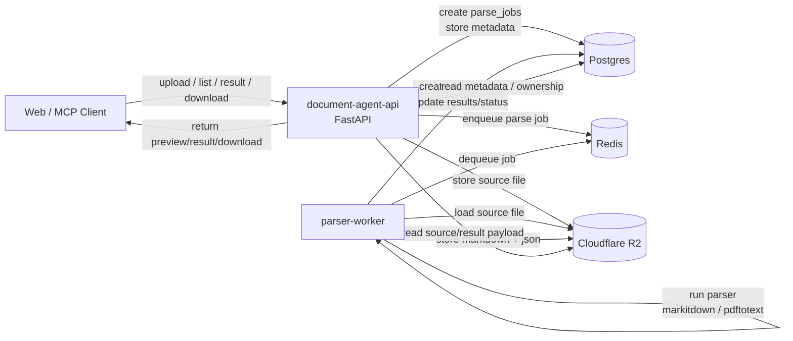

# Architecture

## Overview

- `document-agent-api` is the API layer for the Document AI service.
- It accepts document uploads from the Web app or MCP clients, persists source files, creates parse jobs, and exposes result retrieval and download APIs.
- Parsing itself runs asynchronously in a separate worker process.

## Runtime Components

- `document-agent-api`
  - FastAPI service
  - handles auth, upload, parse job creation, document/result lookup, preview/download APIs
- `parser-worker`
  - consumes queued parse jobs
  - downloads source files
  - runs parser backends
  - stores parse results and updates database state
- `Postgres`
  - source of truth for users, API keys, parse jobs, document metadata, and result metadata
- `Redis`
  - async queue between API and worker
- `Cloudflare R2`
  - object storage for source files and large parse result payloads

## Primary Flow

1. A client uploads a document to `document-agent-api`.
2. The API stores the source file in `Cloudflare R2`.
3. The API creates a `parse_jobs` row in `Postgres`.
4. The API enqueues the job in `Redis`.
5. `parser-worker` dequeues the job from `Redis`.
6. The worker loads the source file from `Cloudflare R2`.
7. The worker runs the selected parser backend.
   - default: `markitdown`
   - fallback: `pdftotext`
8. The worker stores generated Markdown and canonical JSON in `Cloudflare R2`.
9. The worker creates `documents` / `document_results` rows and marks the parse job complete in `Postgres`.
10. Clients later read metadata from the API and fetch preview/download/result payloads through the API boundary.

## Responsibilities By Storage

### Postgres

- authentication and ownership
- parse job lifecycle state
- document metadata
- result metadata
- API key records

### Redis

- queue transport only
- decouples upload request latency from parser execution latency

### Cloudflare R2

- original uploaded file bytes
- Markdown result payload
- canonical JSON result payload

## Railway Deployment View

- Railway service: `document-agent-api`
- Railway service: `parser-worker`
- Railway service: `Postgres`
- Railway service: `Redis`
- external integration: `Cloudflare R2`

The Railway graph shows the internal runtime services. `Cloudflare R2` is outside Railway but is part of the production architecture.

## ASCII Diagram

```text
                 +----------------------+
                 |   Web / MCP Client   |
                 +----------+-----------+
                            |
                            | HTTP
                            v
                 +----------------------+
                 |  document-agent-api  |
                 |  FastAPI service     |
                 +----+------------+----+
                      |            |
          metadata/job|            | source/result bytes
                      v            v
             +----------------+   +----------------------+
             |    Postgres    |   |   Cloudflare R2      |
             | users          |   | source objects       |
             | parse_jobs     |   | markdown result      |
             | documents      |   | canonical json       |
             | document_results|  +----------------------+
             +--------+-------+
                      ^
                      |
                      | update status/result metadata
                      |
                +-----+------+
                | parser-    |
                | worker     |
                +-----+------+
                      ^
                      |
                      | dequeue / poll
                      v
                 +----------------------+
                 |        Redis         |
                 | parse job queue      |
                 +----------------------+
```

## Mermaid Diagram



## Code Pointers

- API entrypoint: `src/main.py`
- document routes: `src/documents/router.py`
- parse job routes: `src/parse_jobs/router.py`
- document service: `src/documents/service.py`
- parse job service: `src/parse_jobs/service.py`
- queue backend: `src/queueing/backends.py`
- storage backend: `src/storage/backends.py`
- worker entrypoint: `src/worker/main.py`
- worker runtime: `src/worker/runner.py`
